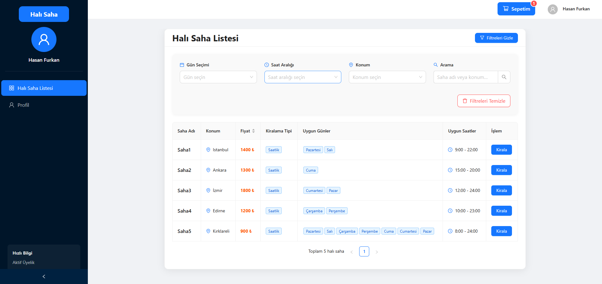
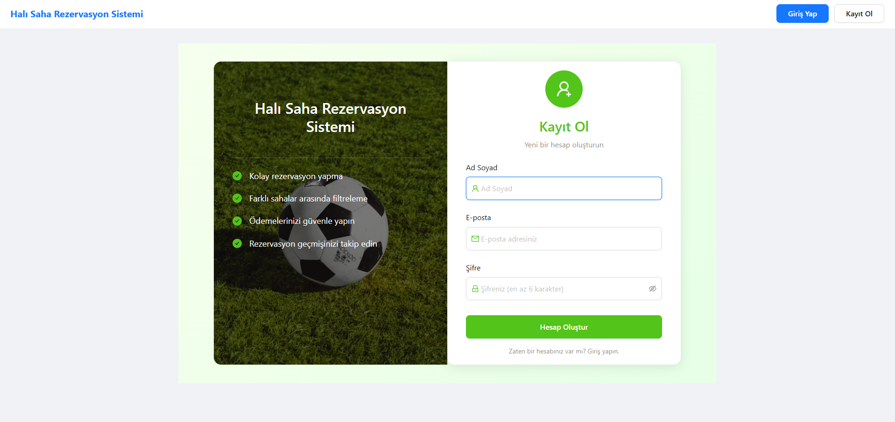
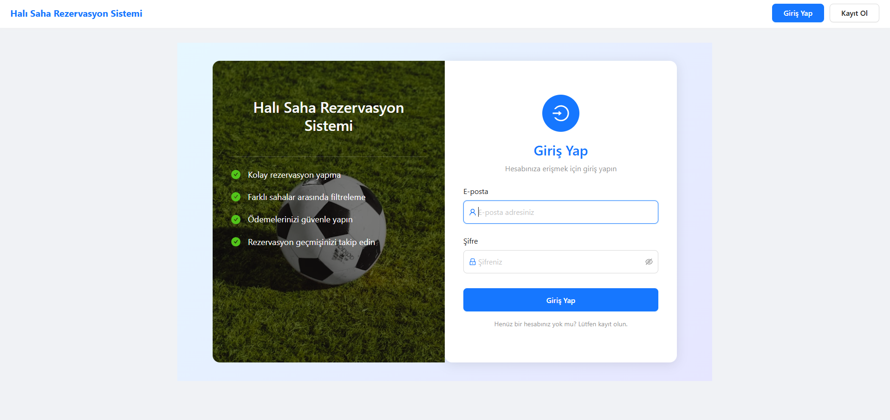
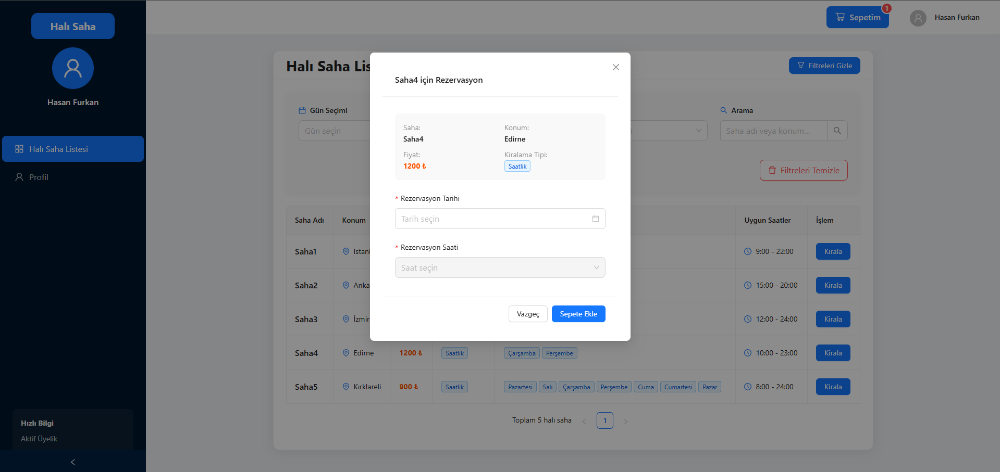
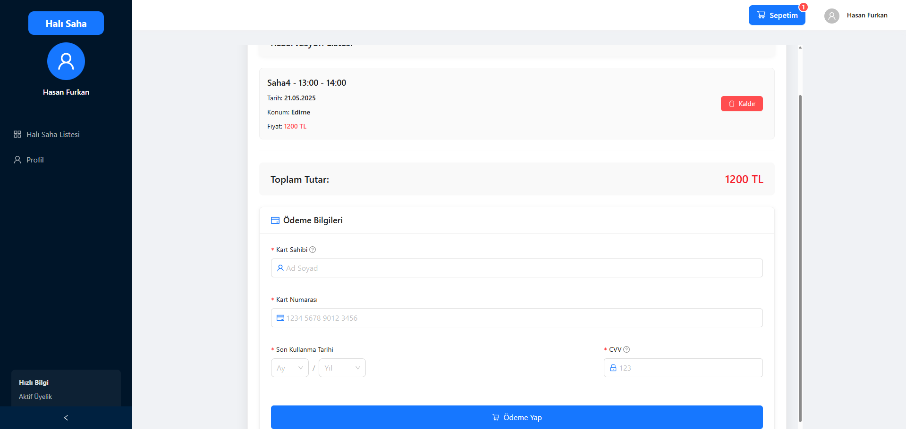
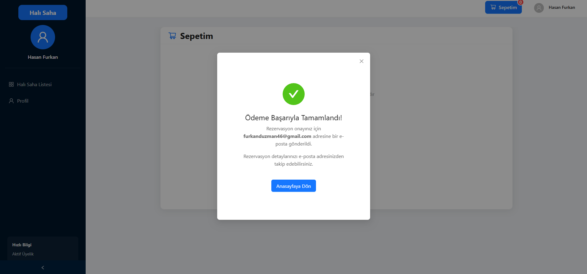
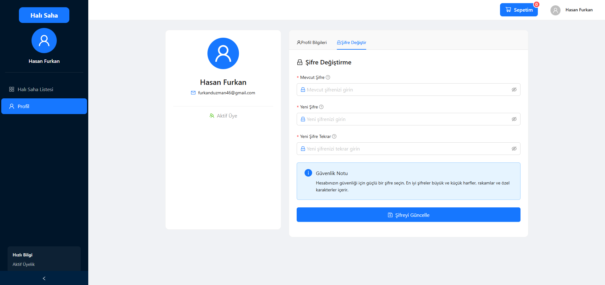
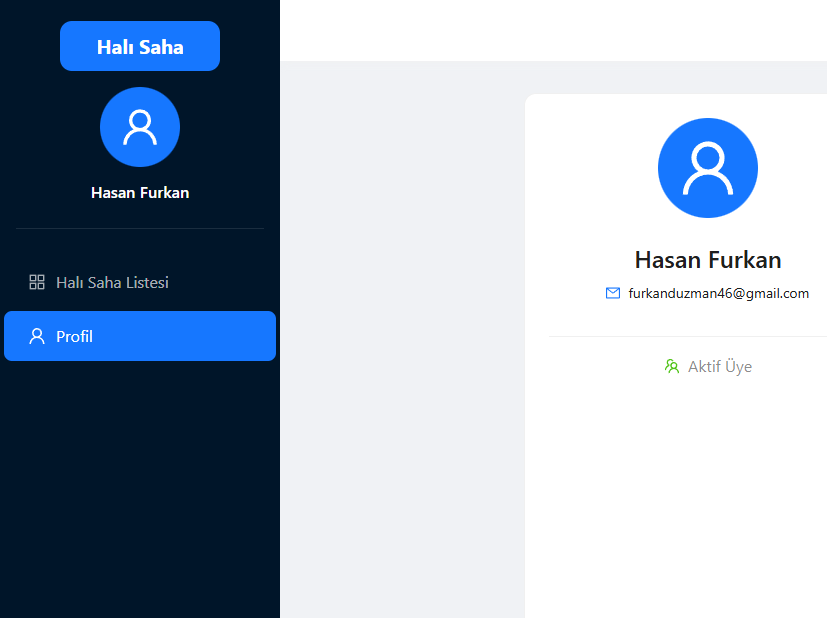

# Halı Saha Yönetim Sistemi

Halı Saha Yönetim Sistemi, halı saha işletmelerinin rezervasyon, ödeme ve müşteri yönetimini kolaylaştırmak için tasarlanmış web tabanlı bir uygulamadır. Sistem, kullanıcıların halı saha rezervasyonlarını kolayca yapabilmeleri, sahip oldukları rezervasyonları görüntülemeleri ve ödeme işlemlerini gerçekleştirmelerini sağlar.



## 🚀 Özellikler

- **Kullanıcı Hesap Yönetimi:** Kayıt olma, giriş yapma ve şifre değiştirme
- **Halı Saha Listesi:** Tüm halı sahaların detaylı listesi
- **Gelişmiş Filtreler:** Gün, saat aralığı ve konum bazlı filtreleme
- **Rezervasyon Yönetimi:** Sahayı kirala, sepete ekle ve ödeme yap
- **Şifre Değiştirme:** Profil sayfasında güvenli şifre değiştirme işlemi
- **E-posta Bilgilendirme:** Rezervasyon onaylarının e-posta ile bildirilmesi
- **Duyarlı Tasarım:** Mobil ve masaüstü cihazlarda sorunsuz kullanım

## 💻 Teknoloji Yığını

- **Frontend:** React, Ant Design, dayjs
- **Backend:** Google Sheets API (sheetbest.com üzerinden)
- **Paket Yöneticisi:** npm
- **Build Aracı:** Vite

## 🔧 Kurulum

Projeyi yerel ortamınızda çalıştırmak için şu adımları izleyin:

1. Repoyu klonlayın:
```bash
git clone https://github.com/Duzman46/hali-saha-yonetim.git
```

2. Proje dizinine girin:
```bash
cd hali-saha-yonetim
```

3. Bağımlılıkları yükleyin:
```bash
npm install
```

4. Uygulamayı başlatın:
```bash
npm run dev
```

## 📱 Kullanım Adımları

### 1. Kayıt Ol veya Giriş Yap

Uygulamayı kullanmak için öncelikle kayıt olmanız veya mevcut hesabınızla giriş yapmanız gerekir.

#### Kayıt Ekranı


#### Giriş Ekranı


### 2. Halı Saha Listesini İncele

Ana sayfada tüm halı sahalar listelenir. Filtreleme seçenekleriyle istediğiniz özelliklerdeki sahaları bulabilirsiniz.


### 3. Rezervasyon Yap

Kiralamak istediğiniz sahayı seçip, uygun tarih ve saati belirleyin.



### 4. Sepetteki Ürünleri Gözden Geçir

Sepetinize eklediğiniz rezervasyonları burada görüntüleyebilir ve ödeme işlemine geçebilirsiniz.



### 5. Ödeme İşlemini Tamamla

Ödeme bilgilerinizi girin ve rezervasyonu onaylayın.



### 6. Profil Bilgilerini Yönet

Profilinizde kişisel bilgilerinizi görüntüleyebilir ve şifrenizi değiştirebilirsiniz.


#### Şifre Değiştirme


#### Şifre Değiştirme Başarılı


## 🤝 Katkıda Bulunma

1. Bu repoyu forklayın
2. Kendi branch'inizi oluşturun (`git checkout -b feature/amazing-feature`)
3. Değişikliklerinizi commit edin (`git commit -m 'Add some amazing feature'`)
4. Branch'inize push edin (`git push origin feature/amazing-feature`)
5. Pull Request açın

## 📝 Özellikler ve İyileştirmeler

- [x] Kullanıcı kaydı ve girişi
- [x] Halı saha listesi ve filtreleme
- [x] Rezervasyon yapma
- [x] Sepet yönetimi
- [x] Ödeme işlemi
- [x] Profil ve şifre değiştirme
- [ ] Geçmiş rezervasyonları görüntüleme
- [ ] Rezervasyon iptal etme
- [ ] Kullanıcı değerlendirme sistemi
- [ ] Mobil uygulama

## 📞 İletişim

Furkan Düzman - [furkanduzman46@gmail.com](mailto:furkanduzman46@gmail.com)

Proje Linki: [https://github.com/Duzman46/hali-saha-yonetim](https://github.com/Duzman46/hali-saha-yonetim)

## 📸 Tüm Ekran Görüntüleri

### Giriş Ekranı


### Kayıt Ekranı


### Ana Sayfa - Halı Saha Listesi


### Rezervasyon Yapma


### Sepet


### Ödeme Onay


### Profil


### Şifre Değiştirme


### Şifre Değiştirme Başarılı

